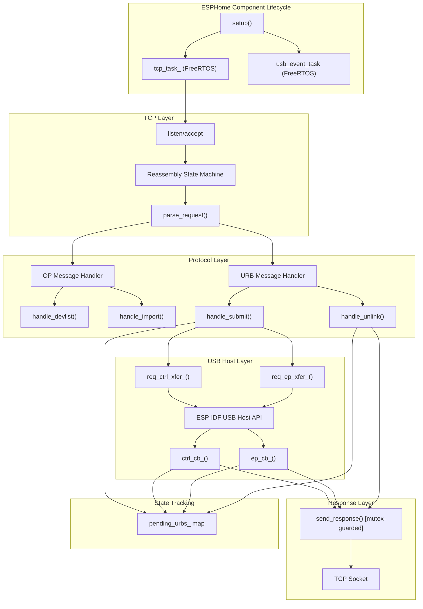

# Design Document: USB/IP Protocol Alignment

## Overview

This design refactors the `USBIPComponent` ESP32-S3 USB/IP server to achieve full protocol compliance with the Linux kernel's `vhci-hcd` module. The existing implementation handles basic OP-layer messages and simple URB forwarding, but has gaps in error handling, unlink tracking, buffer validation, TCP reassembly, and concurrent access that cause failures under real-world conditions (rapid enumeration, concurrent URBs, WiFi instability, device disconnects).

The refactoring targets are the two core files:
- `esphome_components/usb_ip/usb_ip.h` — struct definitions, class declaration
- `esphome_components/usb_ip/usb_ip.cpp` — full protocol implementation

### Design Goals

1. **Protocol correctness** — Match Linux kernel expectations exactly (byte order, field values, message sizes)
2. **Robustness** — Handle partial TCP segments, oversized buffers, concurrent callbacks, device disconnects
3. **Memory safety** — Bounded allocations, tracked ownership, no leaks on any code path
4. **Minimal footprint** — Stay within ESP32-S3 RAM constraints (~320KB usable heap)

### Key Changes from Current Implementation

| Area | Current | Proposed |
|------|---------|----------|
| Unlink handling | Always returns status=0 | Track pending URBs, return -ECONNRESET or 0 |
| Error status | Always -ETIME | Map ESP-IDF status to correct Linux errno |
| Control actual_length | Includes 8-byte setup | Subtract 8 for data-only length |
| Isochronous | Not handled (undefined) | Reject with -ENOSYS, drain payload |
| Buffer overflow | No check | Reject >1024 with -ENOMEM |
| TCP reassembly | Basic loop, no state machine | Proper state machine with message framing |
| Socket writes | Unserialized from callbacks | FreeRTOS mutex for atomic writes |
| Speed reporting | Hardcoded 3 (High Speed) | Dynamic from device enumeration |
| Interface claiming | Single-shot, no race protection | Mutex-guarded once-only claiming |

## Architecture

### Component Structure



### Task Model

| Task | Stack | Priority | Role |
|------|-------|----------|------|
| `usbip_tcp` | 8192 bytes | 5 | TCP accept/recv, message reassembly, parse dispatch |
| `usbip_usb` | 4096 bytes | 5 | USB host client event processing (connect/disconnect) |
| USB callbacks | ISR context → deferred | N/A | Transfer completion, invoked by USB host driver |

### Concurrency Model

- **tcp_task_** owns the receive buffer and message parsing (single-threaded recv loop)
- **USB callbacks** (ctrl_cb_, ep_cb_) fire from the USB host driver's internal task
- **send_response()** is called from both tcp_task_ (error responses, unlink replies) and USB callbacks
- A **FreeRTOS mutex** (`send_mutex_`) serializes all socket write operations
- The **pending URB map** (`pending_urbs_`) is accessed from tcp_task_ (insert on submit, lookup on unlink) and callbacks (remove on completion), protected by `pending_mutex_`

## Components and Interfaces

### 1. TCP Reassembly State Machine

The receive loop implements a streaming parser that handles partial TCP segments and coalesced messages.

```
State: IDLE
  → Accumulate bytes into rx_buf_[4096]
  → When buf_len >= 8: inspect command field to determine message type
  → Compute `needed` bytes for the complete message
  → When buf_len >= needed: dispatch to parse_request(), shift buffer

Message size calculation:
  OP_REQ_DEVLIST:  needed = 8
  OP_REQ_IMPORT:   needed = 40
  USBIP_CMD_SUBMIT: needed = 48 + (direction==OUT ? transfer_buffer_length : 0)
                           + (number_of_packets > 0 ? iso_descriptor_bytes : 0)
  USBIP_CMD_UNLINK: needed = 48
```

**Buffer overflow protection**: If `buf_len` reaches 4096 without forming a complete message, close the connection.

**Message type discrimination**: First read 8 bytes. Check 16-bit command at offset 2 for OP codes (0x8005, 0x8003). If no match, need 48 bytes minimum and check 32-bit command at offset 0 for URB codes (0x00000001, 0x00000002).

### 2. Protocol Message Handler (`parse_request`)

Dispatches based on message type:

```cpp
void parse_request(int sock, uint8_t *buf, size_t len) {
    // OP-layer: devlist, import
    // URB-layer: submit, unlink
    // Unknown: log and discard
}
```

### 3. URB Submit Handler (`handle_submit`)

```
1. Validate device_ready_
2. Check number_of_packets > 0 → reject isochronous (drain payload, respond -ENOSYS)
3. Check transfer_buffer_length > 1024 for OUT → respond -ENOMEM
4. Allocate XferCtx + usbip_submit_t (heap) → on failure respond -ENOMEM
5. Register in pending_urbs_ map (key: seqnum)
6. If EP0: req_ctrl_xfer_()
7. If EP>0: ensure_interfaces_claimed_() then req_ep_xfer_()
8. On submit failure: remove from pending map, respond with error, free allocations
```

### 4. Unlink Handler (`handle_unlink`)

```
1. Extract unlink_seqnum from CMD_UNLINK payload
2. Lock pending_mutex_
3. Lookup unlink_seqnum in pending_urbs_:
   a. Found (URB still pending):
      - Remove from map
      - Set cancelled flag on XferCtx
      - Attempt USB transfer cancel (best effort)
      - Respond with status = -ECONNRESET (-104)
   b. Not found (already completed or unknown):
      - Respond with status = 0
4. Unlock pending_mutex_
```

### 5. Transfer Completion Callbacks

```
ctrl_cb_(xfer) / ep_cb_(xfer):
1. Extract XferCtx from xfer->context
2. Lock pending_mutex_
3. Check if seqnum is still in pending_urbs_ (not cancelled by unlink)
4. If cancelled: free resources, do NOT send response
5. If not cancelled: remove from map, unlock, build and send response
6. Build USBIP_RET_SUBMIT:
   - Map xfer->status to Linux errno
   - For control IN: actual_length = actual_num_bytes - 8
   - For bulk/interrupt IN: actual_length = actual_num_bytes
   - For OUT: actual_length = 0
   - Copy data (IN only, from offset 8 for control)
7. Lock send_mutex_, send header + data atomically, unlock
8. Free XferCtx, usbip_submit_t, usb_transfer_t
```

### 6. Error Status Mapping

```cpp
static int32_t map_usb_status(usb_transfer_status_t status) {
    switch (status) {
        case USB_TRANSFER_STATUS_COMPLETED: return 0;
        case USB_TRANSFER_STATUS_ERROR:     return -EIO;       // -5
        case USB_TRANSFER_STATUS_TIMED_OUT: return -ETIMEDOUT; // -110
        case USB_TRANSFER_STATUS_CANCELED:  return -ECONNRESET;// -104
        case USB_TRANSFER_STATUS_STALL:     return -EPIPE;     // -32
        case USB_TRANSFER_STATUS_OVERFLOW:  return -EOVERFLOW; // -75
        case USB_TRANSFER_STATUS_NO_DEVICE: return -ENODEV;    // -19
        default:                            return -EIO;       // -5
    }
}
```

### 7. Interface Claiming Guard

```cpp
void ensure_interfaces_claimed_() {
    // Uses a simple boolean flag + single-threaded execution from tcp_task_
    // Since all CMD_SUBMIT processing happens in tcp_task_ context,
    // no mutex needed for the claiming operation itself.
    // The flag prevents re-claiming on subsequent calls.
    if (interfaces_claimed_ || !dev_hdl_ || !config_desc_) return;
    for (int n = 0; n < config_desc_->bNumInterfaces; n++) {
        esp_err_t err = usb_host_interface_claim(client_hdl_, dev_hdl_, n, 0);
        if (err != ESP_OK) {
            // Claiming failed — respond with -ENODEV for this and queued URBs
            return;
        }
    }
    interfaces_claimed_ = true;
}
```

### 8. Speed Mapping

```cpp
static uint32_t map_device_speed(usb_speed_t speed) {
    switch (speed) {
        case USB_SPEED_LOW:  return 1;  // USB_SPEED_LOW
        case USB_SPEED_FULL: return 2;  // USB_SPEED_FULL
        case USB_SPEED_HIGH: return 3;  // USB_SPEED_HIGH
        default:
            ESP_LOGW(TAG, "Unrecognized speed %d, defaulting to Full Speed", (int)speed);
            return 2;  // Default to Full Speed
    }
}
```

### 9. Socket Write Serialization

```cpp
static size_t send_response_locked(SemaphoreHandle_t mutex, int sock, const void *data, size_t len) {
    xSemaphoreTake(mutex, portMAX_DELAY);
    size_t result = send_all(sock, data, len);
    xSemaphoreGive(mutex);
    return result;
}
```

For responses with header + data (IN transfers), both parts are sent within a single mutex hold to prevent interleaving.

### 10. Connection Cleanup

```cpp
void cleanup_connection_() {
    // 1. Mark socket as invalid (prevents callbacks from sending)
    int old_sock = client_sock_;
    client_sock_ = -1;

    // 2. Cancel all pending USB transfers
    lock(pending_mutex_);
    for (auto &[seqnum, ctx] : pending_urbs_) {
        ctx->cancelled = true;
        // USB transfer will complete with CANCELED status, callback sees cancelled flag
    }
    pending_urbs_.clear();
    unlock(pending_mutex_);

    // 3. Close socket
    shutdown(old_sock, SHUT_RDWR);
    close(old_sock);
}
```

## Data Models

### Wire Format Structures (packed, big-endian on wire)

```cpp
#pragma pack(push, 1)

// OP-layer common header (8 bytes)
struct usbip_op_common_t {
    uint16_t version;   // 0x0111 (network byte order)
    uint16_t code;      // OP code (network byte order)
    uint32_t status;    // 0 = success (network byte order)
};

// Device descriptor for DEVLIST/IMPORT (312 bytes)
struct usbip_usb_device_t {
    char     path[256];
    char     busid[32];
    uint32_t busnum;          // network byte order
    uint32_t devnum;          // network byte order
    uint32_t speed;           // network byte order
    uint16_t idVendor;        // network byte order
    uint16_t idProduct;       // network byte order
    uint16_t bcdDevice;       // network byte order
    uint8_t  bDeviceClass;
    uint8_t  bDeviceSubClass;
    uint8_t  bDeviceProtocol;
    uint8_t  bConfigurationValue;
    uint8_t  bNumConfigurations;
    uint8_t  bNumInterfaces;
};
static_assert(sizeof(usbip_usb_device_t) == 312);

// Interface descriptor (4 bytes)
struct usbip_usb_intf_t {
    uint8_t bInterfaceClass;
    uint8_t bInterfaceSubClass;
    uint8_t bInterfaceProtocol;
    uint8_t padding;
};

// URB header (20 bytes)
struct usbip_header_basic_t {
    uint32_t command;    // network byte order
    uint32_t seqnum;     // network byte order
    uint32_t devid;      // network byte order
    uint32_t direction;  // network byte order
    uint32_t ep;         // network byte order
};

// CMD_SUBMIT / RET_SUBMIT payload (28 bytes after basic header)
struct usbip_submit_body_t {
    uint32_t transfer_flags_or_status;  // flags (CMD) or status (RET), NBO
    uint32_t transfer_buffer_length_or_actual; // NBO
    uint32_t start_frame;               // NBO
    uint32_t number_of_packets;         // NBO
    uint32_t interval_or_error_count;   // NBO
    uint8_t  setup[8];                  // opaque, not byte-swapped
};

// Complete SUBMIT message (48 bytes header + variable transfer_buffer)
struct usbip_cmd_submit_t {
    usbip_header_basic_t  header;       // 20 bytes
    usbip_submit_body_t   body;         // 28 bytes
    uint8_t transfer_buffer[1024];      // max buffer
};

// CMD_UNLINK / RET_UNLINK (48 bytes total)
struct usbip_unlink_t {
    usbip_header_basic_t header;        // 20 bytes
    uint32_t unlink_seqnum_or_status;   // NBO
    uint8_t  padding[24];               // zeros
};
static_assert(sizeof(usbip_unlink_t) == 48);

#pragma pack(pop)
```

### Internal State

```cpp
// Per-URB tracking context (heap-allocated)
struct XferCtx {
    usbip_cmd_submit_t *req;       // Original request (owns memory)
    int                 sock;       // Socket fd at time of submission
    USBIPComponent     *self;       // Component back-pointer
    uint32_t            seqnum;     // Host byte order, for map lookup
    bool                cancelled;  // Set by unlink handler
};

// Pending URB map: seqnum (host byte order) → XferCtx*
std::unordered_map<uint32_t, XferCtx*> pending_urbs_;

// Synchronization primitives
SemaphoreHandle_t send_mutex_;      // Serializes socket writes
SemaphoreHandle_t pending_mutex_;   // Protects pending_urbs_ map
```

### Class Member Additions

```cpp
class USBIPComponent : public esphome::Component {
    // ... existing members ...

    // New members for protocol alignment:
    SemaphoreHandle_t send_mutex_{nullptr};
    SemaphoreHandle_t pending_mutex_{nullptr};
    std::unordered_map<uint32_t, XferCtx*> pending_urbs_;
    bool claiming_in_progress_{false};
};
```

## Correctness Properties

*A property is a characteristic or behavior that should hold true across all valid executions of a system — essentially, a formal statement about what the system should do. Properties serve as the bridge between human-readable specifications and machine-verifiable correctness guarantees.*

### Property 1: Big-Endian Encoding Correctness

*For any* multi-byte integer value placed into a response message (OP or URB), the bytes at the field's wire offset SHALL be in big-endian order: for 16-bit fields, byte[0] = (value >> 8) & 0xFF and byte[1] = value & 0xFF; for 32-bit fields, byte[0] = (value >> 24) & 0xFF through byte[3] = value & 0xFF.

**Validates: Requirements 1.5, 3.7, 13.1, 13.2, 13.3, 13.4**

### Property 2: Opaque Field Pass-Through

*For any* 8-byte setup packet in a CMD_SUBMIT request, the setup field SHALL appear byte-for-byte identical in the forwarded USB transfer. *For any* transfer_buffer data received from the physical device, the bytes SHALL appear in the RET_SUBMIT response without any byte-order transformation.

**Validates: Requirements 13.5, 13.6**

### Property 3: OP_REP_DEVLIST Structure Integrity

*For any* valid USB device descriptor and configuration descriptor with N interfaces (0 ≤ N ≤ 10), the OP_REP_DEVLIST response SHALL have total length = 12 + 312 + (N × 4) bytes when a device is present, or exactly 12 bytes when no device is present, with all device descriptor fields at their specified byte offsets within the 312-byte structure.

**Validates: Requirements 1.1, 1.2, 1.3, 1.4**

### Property 4: OP_REP_IMPORT Response Format

*For any* OP_REQ_IMPORT request with a busid string, if the busid matches an available device then the response SHALL be exactly 320 bytes with the busid echoed back in the device structure; if the busid does not match, the response SHALL be exactly 8 bytes with a non-zero status field.

**Validates: Requirements 2.1, 2.2, 2.3, 2.6**

### Property 5: Device Speed Mapping

*For any* physical USB device speed value, the speed field in both OP_REP_DEVLIST and OP_REP_IMPORT responses SHALL equal: 1 for Low Speed, 2 for Full Speed, 3 for High Speed, and 2 (with warning) for any unrecognized value. The speed SHALL be identical in both response types for the same device session.

**Validates: Requirements 2.4, 11.1, 11.2, 11.3, 11.5, 11.6**

### Property 6: RET_SUBMIT Response Invariants

*For any* completed USB transfer (success or failure), the USBIP_RET_SUBMIT response SHALL have: command=0x00000003, the original seqnum echoed, devid=0, direction=0, ep=0, start_frame=0, number_of_packets=0, error_count=0, and bytes 40-47 set to zero. For IN transfers with status=0, total response length SHALL equal 48 + actual_length. For OUT transfers or failed IN transfers, total response length SHALL equal 48.

**Validates: Requirements 3.1, 3.2, 3.3, 3.4, 3.5, 3.8**

### Property 7: USB Error Status Mapping

*For any* USB transfer status code from ESP-IDF, the status field in USBIP_RET_SUBMIT SHALL be the corresponding negative Linux errno value (COMPLETED→0, ERROR→-5, TIMED_OUT→-110, CANCELED→-104, STALL→-32, OVERFLOW→-75, NO_DEVICE→-19) encoded as a big-endian signed 32-bit integer. When status is non-zero and direction is IN, actual_length SHALL be 0.

**Validates: Requirements 3.6, 3.8**

### Property 8: Control Transfer Actual Length Correction

*For any* successfully completed control IN transfer where ESP-IDF reports actual_num_bytes (including the 8-byte setup), the actual_length in USBIP_RET_SUBMIT SHALL equal max(0, actual_num_bytes - 8), and only bytes starting at offset 8 in the USB data buffer SHALL be copied to the response transfer_buffer. For control OUT transfers, actual_length SHALL always be 0.

**Validates: Requirements 5.1, 5.2, 5.3, 5.4, 5.5**

### Property 9: Transfer Buffer Overflow Protection

*For any* USBIP_CMD_SUBMIT with transfer_buffer_length > 1024 bytes and direction=OUT, the response SHALL have status=-ENOMEM (-12), actual_length=0, and the original seqnum echoed. *For any* control IN transfer with wLength > 1024, the wLength forwarded to the physical device SHALL be clamped to 1024.

**Validates: Requirements 6.1, 6.3, 6.5**

### Property 10: Unlink Pending URB Returns ECONNRESET

*For any* USBIP_CMD_UNLINK where the unlink_seqnum identifies a URB still in the pending map, the response SHALL have status=-ECONNRESET (-104), and no subsequent USBIP_RET_SUBMIT SHALL be sent for the cancelled URB's seqnum.

**Validates: Requirements 4.1, 4.3**

### Property 11: Unlink Completed URB Returns Zero

*For any* USBIP_CMD_UNLINK where the unlink_seqnum does NOT identify a pending URB (already completed or unknown), the response SHALL have status=0 with the unlink request's own seqnum echoed.

**Validates: Requirements 4.2, 4.4**

### Property 12: Isochronous Transfer Rejection

*For any* USBIP_CMD_SUBMIT with number_of_packets > 0, the response SHALL have status=-ENOSYS (-38), actual_length=0, number_of_packets=0, and no transfer_buffer payload. The full request payload (transfer_buffer + iso descriptors) SHALL be consumed from the TCP stream before the response is sent.

**Validates: Requirements 7.1, 7.2**

### Property 13: TCP Reassembly Correctness

*For any* sequence of valid USB/IP protocol messages delivered across arbitrary TCP segment boundaries (including single-byte segments and multiple messages per segment), all messages SHALL be processed correctly and in arrival order, producing the same responses as if each message arrived in its own segment.

**Validates: Requirements 12.1, 12.2, 12.3, 12.5**

### Property 14: Concurrent URB Seqnum Preservation

*For any* set of concurrently submitted URBs with distinct seqnums, each USBIP_RET_SUBMIT response SHALL echo the exact seqnum from its corresponding USBIP_CMD_SUBMIT, regardless of completion order.

**Validates: Requirements 8.1, 8.2**

### Property 15: Socket Write Atomicity

*For any* two concurrent transfer completions producing responses R1 and R2, the bytes on the TCP stream SHALL contain R1 and R2 as contiguous, non-interleaved units (i.e., no byte from R2 appears between bytes of R1, and vice versa).

**Validates: Requirements 8.3**

## Error Handling

### Error Categories and Responses

| Error Condition | Response | Recovery |
|----------------|----------|----------|
| Device not ready (submit received) | RET_SUBMIT status=-ENODEV | Client retries or detaches |
| Heap exhaustion (XferCtx alloc) | RET_SUBMIT status=-ENOMEM | Client retries |
| Buffer overflow (>1024 OUT) | RET_SUBMIT status=-ENOMEM | Client retries with smaller buffer |
| Isochronous request | RET_SUBMIT status=-ENOSYS | Client driver adapts |
| Unknown endpoint | RET_SUBMIT status=-EPIPE | Client driver handles stall |
| Interface claim failure | RET_SUBMIT status=-ENODEV | Client re-enumerates |
| USB transfer error | RET_SUBMIT status=mapped errno | Client driver handles |
| TCP send failure | Close socket, free all XferCtx | Return to accept loop |
| TCP recv timeout (60s) | Close socket, cleanup | Return to accept loop |
| TCP recv FIN | Close socket, cleanup | Return to accept loop |
| Buffer full (4096) no message | Close socket, reset buffer | Return to accept loop |
| Device disconnect (mid-session) | RET_SUBMIT status=-ENODEV for pending | Wait for client close or timeout |

### Error Response Format

All error responses maintain protocol compliance:
- Always a valid 48-byte RET_SUBMIT or RET_UNLINK
- Always includes the correct seqnum from the original request
- All fields in big-endian byte order
- No trailing data on error responses

### Resource Cleanup Guarantees

1. **Every XferCtx allocation** has exactly one free path:
   - Normal completion: freed in callback after sending response
   - Cancelled by unlink: freed in callback when cancelled flag is detected
   - Connection drop: freed during cleanup_connection_()

2. **Every usb_transfer_t allocation** (from `usb_host_transfer_alloc`) has exactly one free path:
   - Normal/error completion: freed in callback via `usb_host_transfer_free()`
   - Submit failure: freed immediately in req_ctrl_xfer_/req_ep_xfer_

3. **Socket lifecycle**:
   - Opened by accept() in tcp_task_
   - Closed by cleanup_connection_() or normal disconnect handling
   - Never leaked: all error paths eventually reach close()

### Logging Strategy

- `ESP_LOGE`: Allocation failures, interface claim failures, USB submit failures
- `ESP_LOGW`: Protocol violations (malformed messages), timeout disconnects, unknown speed values
- `ESP_LOGI`: Client connect/disconnect, device connect/disconnect
- `ESP_LOGD`: Message parsing, transfer completions, buffer sizes (debug only)

## Testing Strategy

### Approach: Dual Testing with Property-Based Tests

This feature involves protocol message construction, byte-order encoding, state machines, and data transformations — all excellent candidates for property-based testing. The code under test consists of pure functions (message builders, status mappers, size calculators) and stateful protocol logic that can be tested with a mock USB host layer.

### Property-Based Testing Library

**Library**: [Rapidcheck](https://github.com/emil-e/rapidcheck) (C++ PBT framework)
- Integrates with Google Test
- Supports custom generators for structured data
- Minimum 100 iterations per property

Each property test references its design property:
```cpp
// Feature: usb-ip-protocol-alignment, Property 1: Big-Endian Encoding Correctness
RC_GTEST_PROP(USBIPProtocol, BigEndianEncoding, (uint32_t value, uint16_t value16)) {
    // ... test body ...
}
```

### Test Categories

#### Property-Based Tests (automated, 100+ iterations each)

| Property | What's Tested | Generator Strategy |
|----------|--------------|-------------------|
| P1: Big-endian encoding | Serialization of integer fields | Random uint16/uint32 values |
| P2: Opaque pass-through | Setup packet and transfer data preservation | Random byte arrays (8 bytes, 1-1024 bytes) |
| P3: DEVLIST structure | Response size and field offsets | Random device descriptors (0-10 interfaces) |
| P4: IMPORT response | 320-byte success / 8-byte failure format | Random busid strings and device states |
| P5: Speed mapping | Speed enum to USB/IP constant | All valid + random invalid speed values |
| P6: RET_SUBMIT invariants | Fixed fields, response size | Random seqnums, directions, transfer lengths |
| P7: Error status mapping | ESP-IDF status → Linux errno | All USB_TRANSFER_STATUS enum values |
| P8: Control actual_length | 8-byte subtraction, data offset | Random actual_num_bytes (0-1032) |
| P9: Buffer overflow | Rejection of >1024, wLength clamping | Random lengths (1-65535) |
| P10: Unlink pending | -ECONNRESET and suppression | Random pending URB sets + unlink targets |
| P11: Unlink completed | Status=0 for non-pending | Random seqnums not in pending set |
| P12: Isochronous rejection | -ENOSYS response, stream drain | Random iso packet counts and buffer sizes |
| P13: TCP reassembly | Correct parsing across fragments | Random messages split at random boundaries |
| P14: Seqnum preservation | Correct echo in responses | Random concurrent URB sets |
| P15: Write atomicity | Non-interleaved messages | Concurrent response generation |

#### Unit Tests (example-based)

- OP_REQ_DEVLIST with no device → 12-byte response
- OP_REQ_IMPORT with matching busid → 320-byte response (verified byte-by-byte)
- OP_REQ_IMPORT with non-matching busid → 8-byte error response
- CMD_UNLINK with unknown seqnum → status=0
- Partial OP_REQ_DEVLIST (< 8 bytes) → discarded
- Buffer full (4096 bytes junk) → connection closed

#### Integration Tests (hardware-dependent, manual)

- Full enumeration sequence: DEVLIST → IMPORT → GET_DESCRIPTOR → SET_CONFIGURATION
- Concurrent bulk IN/OUT transfers on BT HCI endpoints
- Device disconnect during active transfers
- WiFi reconnect with pending URBs
- `usbip attach` from Linux host to ESP server

### Test Architecture

```
tests/
├── test_protocol.cpp          # Property tests for message format (P1-P9, P12)
├── test_unlink.cpp            # Property tests for unlink state machine (P10, P11)
├── test_reassembly.cpp        # Property tests for TCP reassembly (P13)
├── test_concurrency.cpp       # Property tests for concurrent URBs (P14, P15)
├── mocks/
│   ├── mock_usb_host.h        # Mock ESP-IDF USB host API
│   ├── mock_socket.h          # Mock lwIP socket layer
│   └── mock_freertos.h        # Mock FreeRTOS primitives
└── generators/
    ├── usb_generators.h       # Rapidcheck generators for USB descriptors
    └── protocol_generators.h  # Generators for USB/IP messages
```

### Generator Design

```cpp
// Generate random valid USB device descriptors
Gen<usb_device_desc_t> genDeviceDescriptor() {
    return gen::build<usb_device_desc_t>(
        gen::set(&usb_device_desc_t::idVendor, gen::inRange<uint16_t>(1, 0xFFFF)),
        gen::set(&usb_device_desc_t::idProduct, gen::inRange<uint16_t>(1, 0xFFFF)),
        gen::set(&usb_device_desc_t::bDeviceClass, gen::inRange<uint8_t>(0, 0xFF)),
        // ... etc
    );
}

// Generate random valid CMD_SUBMIT messages
Gen<std::vector<uint8_t>> genCmdSubmit() {
    return gen::map(
        gen::tuple(gen::arbitrary<uint32_t>(),  // seqnum
                   gen::element(0u, 1u),         // direction
                   gen::inRange<uint32_t>(0, 15), // endpoint
                   gen::inRange<uint32_t>(0, 1024)), // buffer length
        [](auto tuple) { /* build wire-format message */ });
}

// Generate random TCP fragmentation of a message sequence
Gen<std::vector<std::vector<uint8_t>>> genFragmented(std::vector<uint8_t> messages) {
    // Split messages at random byte boundaries
}
```

### Mocking Strategy

The protocol logic is tested in isolation by mocking:
1. **USB Host API** (`usb_host_transfer_alloc`, `usb_host_transfer_submit`, etc.) — controllable return values and callback invocation
2. **Socket layer** (`send`, `recv`) — capture output bytes, inject input bytes
3. **FreeRTOS** (`xSemaphoreTake`, `xSemaphoreGive`) — verify mutual exclusion

This allows property tests to run on the host machine (x86) without ESP32 hardware, using a native test build.
